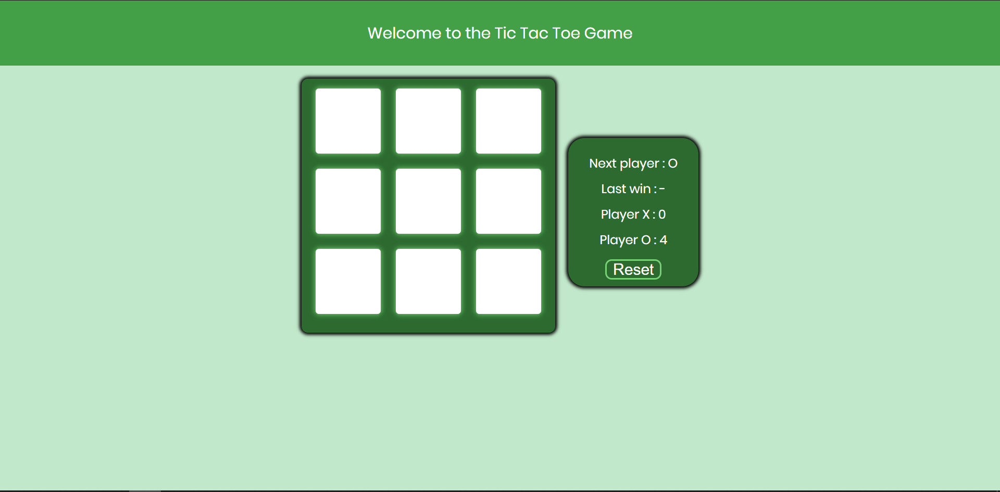

# Card_Verification

A Tic Tac Toe is a simple game built with Vanilla.js. Tic tac toe is a paper-and-pencil game for two players, X and O, who take turns marking the spaces in a 3×3 grid. The player who succeeds in placing three of their marks in a horizontal, vertical, or diagonal row is the winner.



This game contains leaderboards in which you can find out:

- who move is next
- who last one won
- result

## Getting Started

See the program operation in the link below or download the project, download it to your computer. Then follow the instructions.

### Installing

To initiate the project, enter in the terminal:

```
npm install
```

To start a live server, enter in the terminal:

```
npm run start
```

To create a distribution version, type in terminal:

```
npm build
```

## Built With

- HTML
- SCSS
- JavaScript
- GIT
- Parcel

## Author

- **Jarkowski Tomasz**

## License

For personal use only. Do not distribute.
